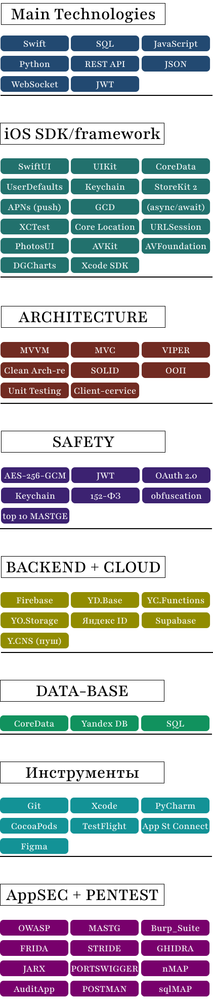

  

🧑‍💻 Евгений Черников  | iOS Developer | Application Security Engineer
📍 Краснодар, Россия | 2_zheka@bk.ru | +7 (938) 544-86-33

---------------
Я iOS-разработчик с 2+ годами опыта, который целенаправленно переходит в сферу Application Security (AppSec). 
Мой подход — не просто поиск багов, а понимание полного цикла безопасности: от проектирования и разработки до аудита и защиты реальных продуктов.
---------------------
🛡️ Мой учебный стенд: MeetWay (Full-stack iOS Social Network)

MeetWay — это не просто приложение в моём портфолио. Это полнофункциональный стенд для практического изучения безопасности, который я разработал с нуля (iOS, бэкенд, инфраструктура). Здесь я моделирую, исследую и устраняю реальные уязвимости.

-----------------

[Лаборатория 1: SQL injection...](https://github.com/EV9EN1Y/portswigger-academy-solutions/blob/main/SQLi_all_lab/SQLi_lab_01.md)

----------------

  

-----------------

