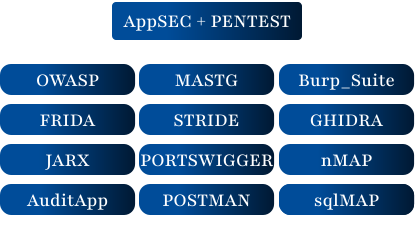

  

# В ПРОЦЕССЕ РЕДАКТИРОВАНИЯ......

🧑‍💻 Евгений Черников | iOS Developer → Application Security Engineer

📍 Оренбург, Россия | 📧 2_zheka@bk.ru | 📱 +7 (938) 544-86-33

Привет! Я iOS-разработчик с 2+ годами опыта, который целенаправленно переходит в сферу Application Security (AppSec). Мой подход — не просто поиск багов, а понимание полного цикла безопасности: от проектирования и разработки до аудита и защиты реальных продуктов.

🛡️ Мой учебный стенд: MeetWay (Full-stack iOS Social Network)

MeetWay — это не просто приложение в моём портфолио. Это полнофункциональный стенд для практического изучения безопасности, который я разработал с нуля (iOS, бэкенд, инфраструктура). Здесь я моделирую, исследую и устраняю реальные уязвимости.

Стек и реализация	Безопасность как учебный проект
• iOS: Swift, SwiftUI, JWT, Keychain
• Бэкенд: Yandex Cloud (YDB, YCF, ID), REST API
• Шифрование: AES-256-GCM для чатов
• Архитектура: MVVM, SOLID, ООП	• Цель: Практический аудит всех компонентов (клиент, API, БД, облако).
• Подход: Создание PoC для уязвимостей → Разбор кода → Разработка фикса.
• Фокус: Безопасность мобильных приложений (MASVS), OWASP Top 10 (Web/API).
🔬 Моя практика в AppSec

На примере проекта MeetWay я исследую и документирую следующие направления:

🔎 Основные векторы атак (на практике)
Аудит REST API: Поиск IDOR, SQLi, SSRF, проблем с JWT и бизнес-логикой (Burp Suite, ручное тестирование).
Мобильная безопасность: Анализ хранения данных (Keychain/UserDefaults), IPC, защита бинарника от реверс-инжиниринга (MobSF, Frida).
Уязвимости аутентификации: Тестирование механизмов входа (Yandex ID, соцсети), контроль сессий, безопасность OAuth-потоков.
Статический анализ (SAST): Поиск уязвимых паттернов в исходном коде Swift/бэкенда (Semgrep, ручной аудит).
Threat Modeling: Построение диаграмм угроз (STRIDE) для проектирования безопасной архитектуры с нуля.
📂 Структура моих исследований (в репозиториях)

Теория и контекст: Описание уязвимости, ссылки на OWASP/MASVS.
Proof of Concept (PoC): Скриншоты/видео эксплуатации (Burp Suite, терминал).

Разработка (Development)	Безопасность (Security)
Языки: Swift, Python
iOS: UIKit, SwiftUI, CoreData, Concurrency
Бэкенд: REST API, SQL/YDB, Docker (базово)
Инструменты: Git, Xcode, Figma, Firebase/Supabase	Методологии: OWASP Top 10, MASVS, Threat Modeling (STRIDE)
Инструменты: Burp Suite, MobSF, Semgrep, Wireshark (базово)
Практика: PortSwigger Academy, HTB/TryHackMe labs, анализ write-ups
🧭 Мой подход и цели

Я верю, что настоящая безопасность закладывается на этапе проектирования. Мой опыт full-stack разработки позволяет мне понимать продукт целиком — от UI до схемы БД, что критически важно для эффективного Security Engineer.

Курсы: Прохожу лаборатории PortSwigger Web Security Academy. Изучаю OWASP WSTG и Mobile Security Testing Guide (MSTG).
Практика: Решаю задачи на HackTheBox и TryHackMe, анализирую реальные отчеты об уязвимостях.
Постоянное развитие: Читаю технические блоги по безопасности, слежу за новыми CVE в экосистеме Apple и мобильной разработки.

[Лаборатория 1: SQL injection...](https://github.com/EV9EN1Y/portswigger-academy-solutions/blob/main/SQLi_all_lab/SQLi_lab_01.md)

|

------------------------
| My_Projects |
|--------------------|

|           |           |           |
|-----------|-----------|-----------|
||||
------------------------
MeetWay
TradingDiary
Empire

| Основные технологии и языки |
|--------------------|

|           |           |           |
|-----------|-----------|-----------|
|   |   |   |
|   |   |   |
|   |   ||
------------------------
Swift
SQL
JavaScript
Python
JSON
WebSocket
REST_API
JWT

| iOS SDK и фреймворки |
|--------------------|

|           |           |           |
|-----------|-----------|-----------|
|  |  |  |
|   |   |   |
|   |   |   |
||||
||||
------------------------

| Архитектуры и принципы проектирования |
|--------------------|

|           |           |           |
|-----------|-----------|-----------|
|  |  |  |
|   |   | |
|  |
------------------------

| Безопасность |
|--------------------|

|           |           |           |
|-----------|-----------|-----------|
|  |  |  |
------------------------

| Бэкенд и облачные сервисы |
|--------------------|

|           |           |           |
|-----------|-----------|-----------|
|  |  |  |
|   |   |   |
|   |||
------------------------

| Базы данных |
|--------------------|

|           |           |           |
|-----------|-----------|-----------|
|  |  |  |
|   |||
------------------------

| Инструменты и инфраструктура |
|--------------------|

|           |           |           |
|-----------|-----------|-----------|
|  |  |  |
|   |   |   |
|   |||
------------------------

| AppSEC + PENTEST |
|--------------------|

|           |           |           |
|-----------|-----------|-----------|
|  |  |  |
|  |  |  |
|  |  |  |
|  |  ||
------------------------

  

