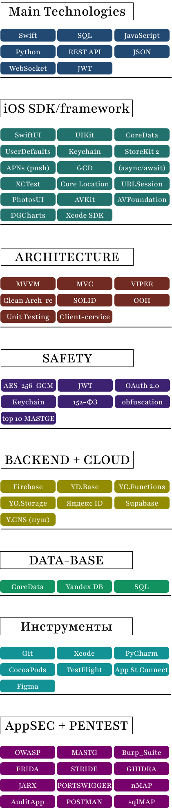

  

🧑‍💻 Евгений   | iOS Developer | Application Security Engineer
📍 Россия    | 2_zheka@bk.ru | +7 (938) 544-86-33

---------------
Я iOS-разработчик с 2+ годами опыта, который целенаправленно переходит в сферу Application Security (AppSec). 
Мой подход — не просто поиск багов, а понимание полного цикла безопасности: от проектирования и разработки до аудита и защиты реальных продуктов.
---------------------
🛡️ Мой учебный стенд: MeetWay (Full-stack iOS Social Network)

MeetWay — это не просто приложение в моём портфолио. Это полнофункциональный стенд для практического изучения безопасности, который я разработал с нуля (iOS, бэкенд, инфраструктура /30+экранов). Здесь я моделирую, исследую и устраняю реальные уязвимости.
---------------------

-----------------
ПРОСМОТРЕТЬ МОЕ РЕЗЮМЕ:➤______________
----------------
УЗНАТЬ ПРО МОИ ПРОЕКТЫ:➤_______________
----------------
ИЗУЧИТЬ МОЙ УЧЕБНЫЙ ПОЛИГОН:➤________
----------------

[Почему я перешел в ИБ?]
- Создав свой большой проект (соц. сеть) я столкнулся с обязанностью обеспечить безопастность пользователей и всех серверных данных.
- Начал внедрять защиту в клиентскую и серверную части проекта. Начав разбираться в этой теме, понял, что есть тысячи нюансов по ИБ!
- Появился большой интерес к професии инженера по ИБ.

  

-----------------

